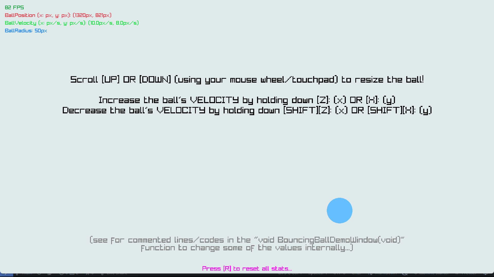
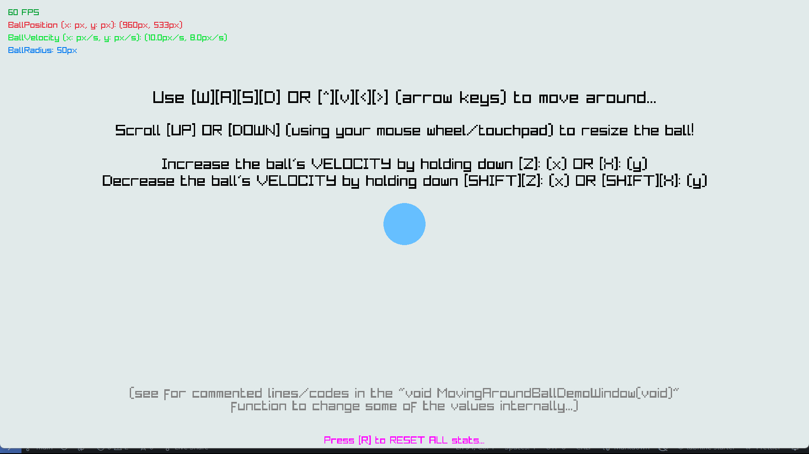
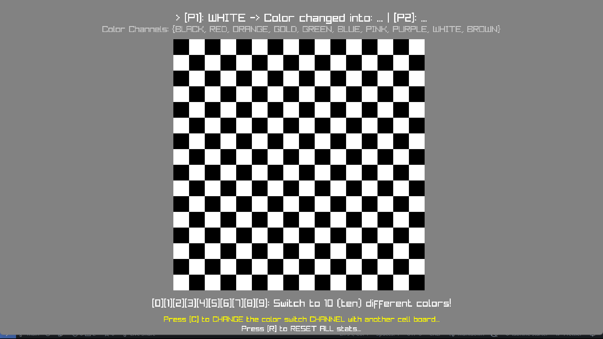
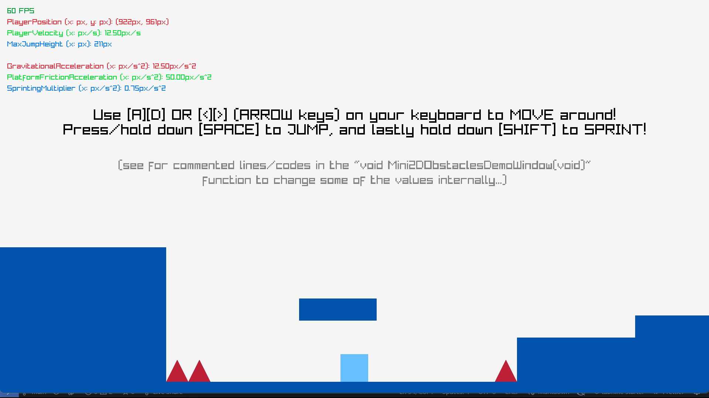
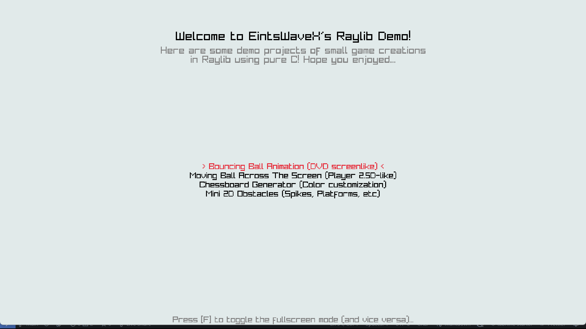

# EWX-Minigames

## Collections of sample of minigames. Now: 4 samples

Welcome to my most favourite sample collections of minigames, created purely in C with the help of the game creation library, called **Raylib**!

In this specific repository, you'll be exploring amazing stuffs that might be interesting to look at, and since this is my first ever game creation purely in C (without any external dependencies or third-party apps and similar frameworks), all the codes that written here might be looking real janky and dirty at the same time, but that's the process of learning new stuffs and be making new creations, over and over again!

***

## Explanations and Overviews

### Minigame Samples: 4 (four) in total

**FEATURING(s)**:
> Bouncing Ball Animation (DVD screenlike)

    > Defined at: void BouncingBallDemoWindow(void);

*What it does?*
Basically, it's just like an old fascinating animations from CDs/DVDs cassette back then since early 1990 and such, but more like in an 2D object called CIRCLE though, but with some CONTROLS that might be interesting...

> Moving Ball Across The Screen (Player 2.5D-like)

    > Defined at: void MovingAroundBallDemoWindow(void);

*What it does?*
This feature DOES have the similar functionality as in the first one above, but with more CONTROLS from the user who's trying to play with the game here! The user is freely to move around across the map with the given functionalities, and more!

> Chessboard Generator (Color customization)

    > Defined at: void ChessboardGeneratorDemoWindow(void);

*What it does?* This feature is simply generating a bunch of `N x M` size of matrix, with each grids are actually just squares *(see the implementation of the feature here, because everything there is hard-coded either way)*. The user can customize each cells automatically (with two different color channels), up to 10 different colors!

> Mini 2D Obstacles (Spikes, Platforms, etc)

    > Defined at: void Mini2DObstaclesDemoWindow(void);

*What it does?* This one is the hardest one I probably tried to make within 2-4 days in row. You gotta understand a lot of different logics and maths related stuff to calculate things like `collisions, obstacles' positions, hitboxes, etc...` Might be a bit excruciating, but it comes pretty well at the end of the day, and I really like how far I've gone to try and learn making a simple game from literal scratch! This minigame in particular is similar to `Geometry Dash`, but worse... :)

***

## Getting Started

First, before you starting to compile and run the program, you might want to clone this repository firsthand, but you can also participate to help the project further by doing some forks!

### 1. Clone and/or Fork The Repository

Let's clone this repository first, just open your CMD/terminal from your OS, then `CTRL-C + CTRL-V` the command down below:

    git clone https://github.com/EintsWaveX/EWX-Minigames.git

### 2. Run the Application

After you've done cloning/forking the repository, then you're done basically! If you just want to run the application, directly copy and paste the command below!

On Windows:

    ./EWX-Minigames.exe

On UNIX/POSIX:

    ./EWX-Minigames

There you go! You've successfully run the application, and you can freely try to experience 4 of different samples there! Might not be much, but it's still a thing to enjoy, hehe...

### (Optional) Compile and Run Simultaneously

But, what if you want to edit some of the changes first (and it makes you to have to compile the code again)? Well, nothing to be worried because of your DLL files failed to link dynamically from the GCC's linker. What you have to do is just to copy and paste the codes and execute it on your CMD/terminal!

    gcc -Wall -Wextra -ggdb -pedantic -o EWX-Minigames EWX-Minigames.c -lraylib -lm
    # Windows:    ./EWX-Minigames.exe
    # UNIX/POSIX: ./EWX-Minigames

Time to elabore the command(s) above!
First, we provide the compiler for C, and of course it's the good ol' GNU GCC Compiler! Then, the next 4 subcommands is basically checking for:

> `-Wall -Wextra`

**USAGES:** Checking for ALL and EXTRA HIDDEN warnings.

> `-ggdb`

**USAGES:** Debugging purposes with `gdb` or external debugging application (*for developers only*)!

> `-pedantic`

**USAGES:** Here we check all the C syntaxes and codes that may violate the rule of `C99` interpretation. Basically correcting the warnings for better performance and workflow of the application at compile-time and runtime.

Then, we use the last 2 subconmmands, followed as:

> `-lraylib -lm`

**USAGE:** Here we linked the executable with the dynamic library linker for Raylib and for mathematical functions and operations, respectively.

***

## End of Workflow

Thank you so much for visiting my repository, and I hope I can leave some impressions as for I just started creating things using Raylib for around 2-4 days until the day this repository was commited! Have a nice day... :)
